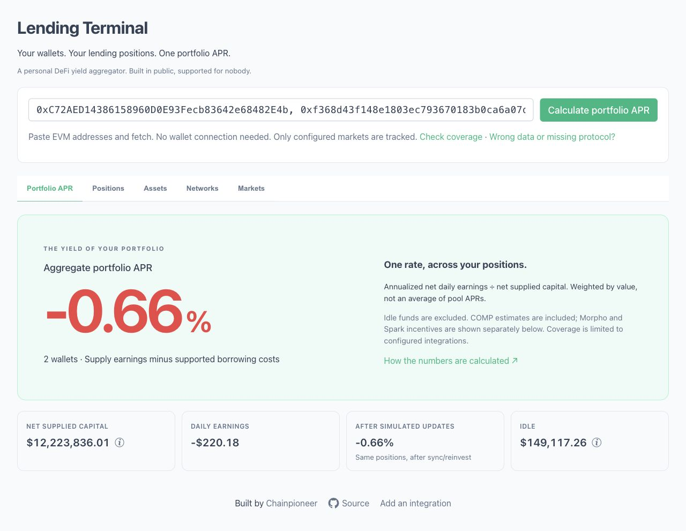

# Lending Terminal

**A personal DeFi yield aggregator. See the APR of your whole lending portfolio.**

Start with one aggregate portfolio APR across your wallets and configured lending positions. Then inspect positions, assets, networks and markets in separate tabs — including the smaller protocols that tend to fall through the cracks.

**[Open the terminal](https://chainpioneer.github.io/lending-terminal/)** · [Request a protocol](https://github.com/chainpioneer/lending-terminal/issues/new?template=protocol-request.md) · [Add an integration](CONTRIBUTING.md)

*Built in public, supported for nobody.*

Built by **[Chainpioneer](https://github.com/chainpioneer)** for the wallets and markets I actually use. Follow my work on GitHub, or [bring a market or calculation question to the issues](https://github.com/chainpioneer/lending-terminal/issues).



*Aggregate APR for two public example wallets, captured October 4, 2026. Rates are a snapshot, not a forecast.*

## Why this exists

I use multiple wallets and lending protocols, including some fairly obscure ones. Other trackers don't always support the positions I have, or show the numbers I want. I wanted one screen for my actual positions, so I built it.

If you have the same problem, this might be useful. Coverage follows what I use, not a roadmap to integrate all of DeFi.

## What it tracks

- **Multiple addresses:** paste comma-separated EVM addresses and click **Calculate portfolio APR**. No wallet connection is needed to read positions. The address list is saved in this browser's localStorage after a successful fetch; ENS names aren't resolved.
- **Lending and vault deposits:** underlying amounts, USD values, estimated daily earnings, supply APR, pool TVL and utilization where implemented.
- **Borrowing:** Aave variable debt and the configured Compound III market, with collateral, borrowing costs, estimated health factors and resulting position APR. This is not general borrowing coverage across every integration.
- **Rewards:** estimated daily incentives from Merkl for Morpho vaults, Spark campaigns and Compound COMP emission rates. These are rate-based estimates, not claimable reward balances or a claim interface.
- **Aggregation:** portfolio, asset and network views, plus per-address breakdowns where populated. Idle balances include native tokens and configured Impermax/Tarot underlying tokens, not every ERC-20 in a wallet.
- **Portfolio composition:** counts of protocols, chains, assets and positions with nonzero tracked supply or supported debt, before market filters. A position is a market + asset, merged across wallets and supply/borrow sides. Asset symbols are merged across chains; idle balances are excluded.
- **Share result:** creates a PNG with APR, composition counts, snapshot date and the app link, without wallet addresses or balances. Choose Share on X to copy the image, then open X and paste with ⌘V / Ctrl+V; the composer prefills text and link. Copy image also works for other apps. A download link is available if clipboard access is blocked. No portfolio is uploaded or encoded in the link.
- **Pool comparison:** sorted by supply APR plus reward APR, with network/asset/protocol filters and an “Only my deposits” switch. The loader keeps pools with deposits above $1, or pools above the configured APR, capacity and TVL thresholds (currently >2%, >−$1 and >$1,000).
- **Limited transactions:** deposit/withdraw and sync for Impermax/Tarot pools with configured routers on Base, Optimism, Avalanche and Sonic. Uses the injected `window.ethereum` wallet; other integrations link to their own interfaces.

### What the APR numbers mean

- **Impermax/Tarot:** supply APR comes from borrow rate × utilization × (1 − reserve factor). The before/after rates use state before and after a simulated `sync()` in an RPC call. Vault yield uses historical exchange-rate changes with simulated `reinvest()` calls. Reading these estimates does not send transactions.
- **Aave:** the reserve liquidity rate. **Extra:** the borrowing rate × utilization, net of the reserve fee.
- **Morpho, Revert and most Spark vaults:** annualized exchange-rate change over a recent block window. Gnosis sDAI uses its configured adapter's `vaultAPY()` value, displayed in the APR field without converting APY to APR.
- **Portfolio APR:** annualized net daily earnings divided by net supplied capital, excluding idle funds. **After simulated updates** uses the higher of before/after simulated earnings for each position; asset/network arrows show the same comparison. It is not an optimizer or a forecast of moving funds. Asset/network summaries describe supply earnings; the portfolio calculation also incorporates supported borrowing costs and estimated COMP, Morpho and Spark incentives. The reward breakdown below the headline is already included in portfolio APR and daily earnings, including the simulated-update figures. Missing incentive data is excluded, so unavailable rewards can understate APR.

Short sampling windows, stale prices and missing reward data can distort these numbers. Check the protocol before acting on them.

## Supported protocols and networks

This table reflects the active configuration in [constants.ts](src/constants/constants.ts), not everything these protocols offer.

| Integration | Configured networks | Scope / limits |
| --- | --- | --- |
| Impermax / Tarot | Base, Optimism, Avalanche, Sonic | Explicit borrowable allowlists, supply positions and LP collateral estimates. Protocol labels come from onchain token names; the two share a processor. Not general debt tracking. |
| Aave v3 | Ethereum, Base, Optimism | All 96 reserves returned by the three configured pools as of October 4, 2026 (67 Ethereum / 15 Base / 14 Optimism); supply and variable debt. eMode handling is limited to category 1. |
| Compound III | Base | One configured AERO borrowing market; collateral, debt, cost and COMP rate estimates. Not general Compound supply tracking. |
| Morpho vaults on Morpho Blue | World Chain | Two configured vaults, underlying-market utilization and Merkl incentives. No active borrowing integration. Only one recognized reward-token type per vault is included. |
| Spark | Avalanche, Gnosis | One vault per chain; Avalanche campaigns via the rewards proxy, Gnosis sDAI via its APY adapter. Unknown reward tokens are skipped. |
| Revert Finance | Ethereum, Base, Arbitrum | One lending vault per chain. Lender shares and yield, not borrowers' Uniswap NFT positions. |
| Extra Finance | Base | USDC reserve 25, including staked and unstaked supply. No EXTRA incentive calculation. |

The full asset list, exact token addresses and decimals are in [constants.ts](src/constants/constants.ts). Aave includes USDT, DAI, GHO, LST/LRT assets, BTC wrappers and individual Pendle PT maturities, including reserves with remaining balances after maturity. Coverage is a checked-in snapshot, not automatic discovery of future listings. Tokens are explicitly mapped per chain; a symbol does not imply coverage everywhere.

## How it works

```text
Browser → public RPCs → Multicall3 → configured contracts
        → DefiLlama prices (CoinGecko IDs); OX fallback via DexScreener
        → Aave Oracle prices for newly added Aave assets
        → Merkl campaigns
        → Cloudflare Worker → Spark rewards API
```

Vue 3 + TypeScript + Vite + PrimeVue, with ethers, web3 and ethcall. The frontend is hosted on GitHub Pages. There is no position database or project-operated indexer; [the Worker](worker/src/index.ts) is a CORS proxy for Spark's Block Analitica API, so this is not entirely backend-free.

[load.ts](src/logic/load.ts) loads all configured chains in parallel, builds staged Multicall3 batches, reads historical state where needed, then delegates calculations to `process*.ts` modules. [provider.ts](src/provider/provider.ts) handles RPC selection and retries. There are four main multicall stages, additional Morpho market reads and block lookups; request count varies with configuration, batching and retries.

New Aave assets use a canonical Aave Oracle source per asset (including PTs); existing assets keep their DefiLlama prices. These are oracle valuations, not executable swap quotes. The health-factor model still has limited eMode/collateral handling, so full asset coverage does not guarantee parity with the protocol’s health factor.

Addresses live locally, but RPC requests containing them go to the configured providers. Prices and reward rates depend on external APIs. RPC endpoints must allow browser requests and the historical reads used by the integration.

## Running locally

Use Node.js 20.19+, 22.13+ or 24+ and Yarn Classic (1.22.x); the deployment workflow uses Node 20 and the checked-in `yarn.lock`.

```sh
git clone https://github.com/chainpioneer/lending-terminal.git
cd lending-terminal
npx --yes yarn@1.22.22 install --frozen-lockfile
npx --yes yarn@1.22.22 dev
```

Open the localhost URL printed by Vite (normally `http://localhost:5173`). No `.env` or API key is required for the default setup. Paste addresses and calculate portfolio APR, then use the Positions, Assets, Networks and Markets tabs. All chains are queried, so the first fetch can take a while.

```sh
npx --yes yarn@1.22.22 lint
npm run test:aave
node scripts/check-portfolio.mjs
node scripts/check-portfolio-rewards.mjs
node scripts/check-rpc-retries.mjs
npx --yes yarn@1.22.22 build
npx --yes yarn@1.22.22 preview
```

Production preview is at `http://localhost:4173/lending-terminal/`. The build uses that base path. Pushes to `main` deploy through [GitHub Actions](.github/workflows/deploy.yml); `npm run deploy` is the older, separate `gh-pages` publishing command.

RPCs, market addresses, token maps and filter thresholds live in [constants.ts](src/constants/constants.ts). No Worker deployment is needed to run the frontend: it uses the configured hosted Spark proxy. Its allowed development origins are `http://localhost:5173` and `http://localhost:4173`; another hostname or port needs a proxy configuration change.

If a fetch hangs, check the browser console/network tab for the failing chain or price API. A failed chain prevents the combined result from rendering. RPC requests time out after 15 seconds per attempt and try each configured provider at most twice; if they all fail, the UI offers another attempt.

## Adding a protocol

Already supported contract shape? Start with the relevant market list and asset map in `CHAIN_CONF`. A genuinely new protocol needs an ABI, calls in [load.ts](src/logic/load.ts), a processor that fills the shared pool/stat structures, and display links in [chainMappings.ts](src/utils/chainMappings.ts).

[CONTRIBUTING.md](CONTRIBUTING.md) walks through the shortest path, with Extra Finance as a small working reference. There is no plugin registry to implement.

## Requests and incorrect data

Using some obscure lending protocol that nothing tracks properly? [Open a protocol request](https://github.com/chainpioneer/lending-terminal/issues/new?template=protocol-request.md). If it's interesting enough, I might add it. A contract address and a position to reproduce beat a ticker and a screenshot.

[Report incorrect data or RPC/network problems](https://github.com/chainpioneer/lending-terminal/issues/new?template=incorrect-data.md). Include the chain, market, expected result and what the terminal showed. A public wallet address helps if you're comfortable sharing it. Integration proposals and PRs are welcome; there's no promise of ongoing support.

## Philosophy / non-goals

Opinionated, built for actual personal use, and maintained around the positions I have. Not a replacement for every portfolio tracker, a transaction-history indexer, or an attempt to support every protocol in existence. An integration working for my positions does not mean every position or edge case is covered.
